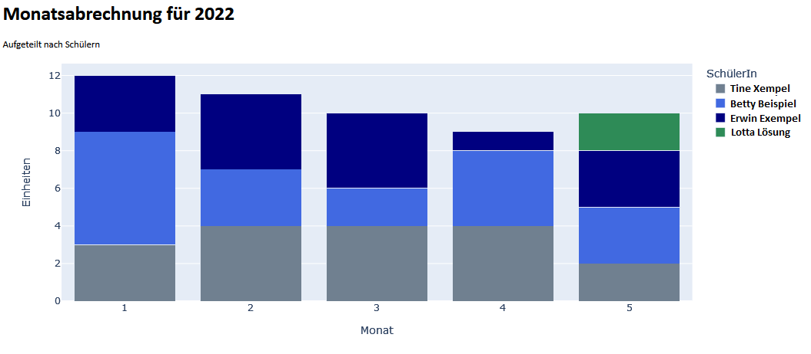

# NachhilfeDB

Eine Datenbank für NachhilfelehrerInnen zur Buchführung über geleistete Nachhilfestunden.
SchülerInnen können eins oder mehrere Schulfächer zugeordnet werden, die man unterrichtet.
Es wird auch die Unterrichtsart (online oder vor Ort) zu einem Auftrag gespeichert.

## Funktionalität

### Terminplanung
* Einmalige und wiederkehrende Termine eintragen
* Terminübersicht abfragen (coming soon&hellip;)

### Fachbelegung
* Mehrere Aufträge desselben Schulfachs nacheinander sind möglich, aber nicht zeitgleich.
  So sind zum Beispiel wiederkehrende Kurzaufträge möglich.

### Unterricht
* Geleistete Unterrichtsstunden können über die Prozedur `pr_TerminEintragen` eingetragen werden.
  Unterrichtstermine dürfen hierbei nicht in der Zukunft liegen.
* Vorab kann für jeden Monat und SchülerIn geplante Stundenzahl vorab eingetragen und mit den tatsächlich geleisteten Einheiten verglichen werden.

### Bilanzen
* Über die Funktion `sf_Jahreseinnahme` und `sf_Monatseinnahme` kann der Jahres- bzw. Monatsverdienst abgefragt werden.
  Der Preis pro Einheit ist als konstanten Wert vorauszusetzen.
* Über Python werdend tabellarische und auch grafisch aufbereitete HTML-Ausgaben erzeugt.

### Beispiele

